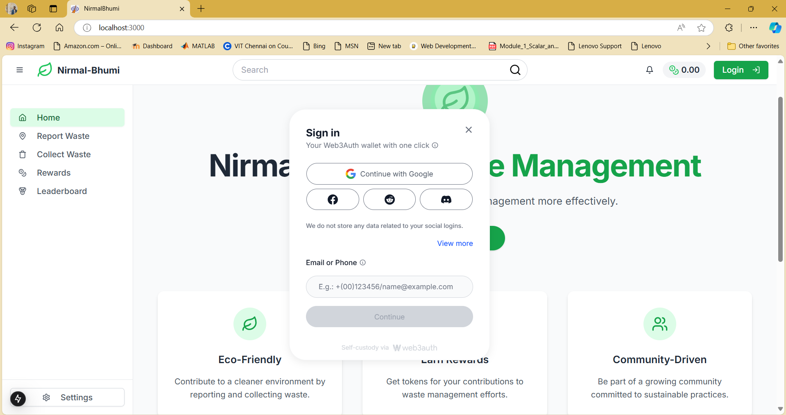
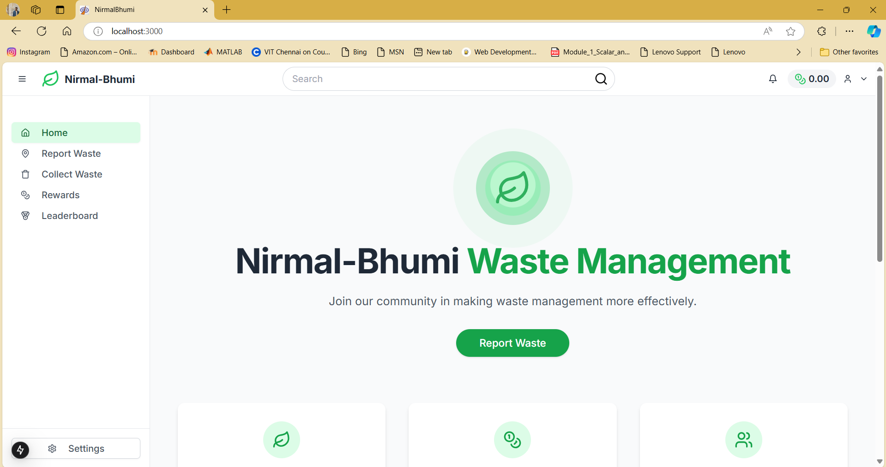
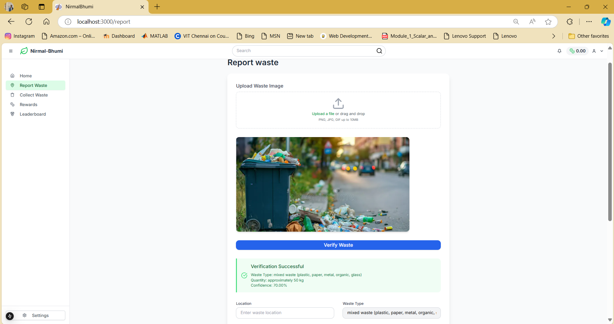
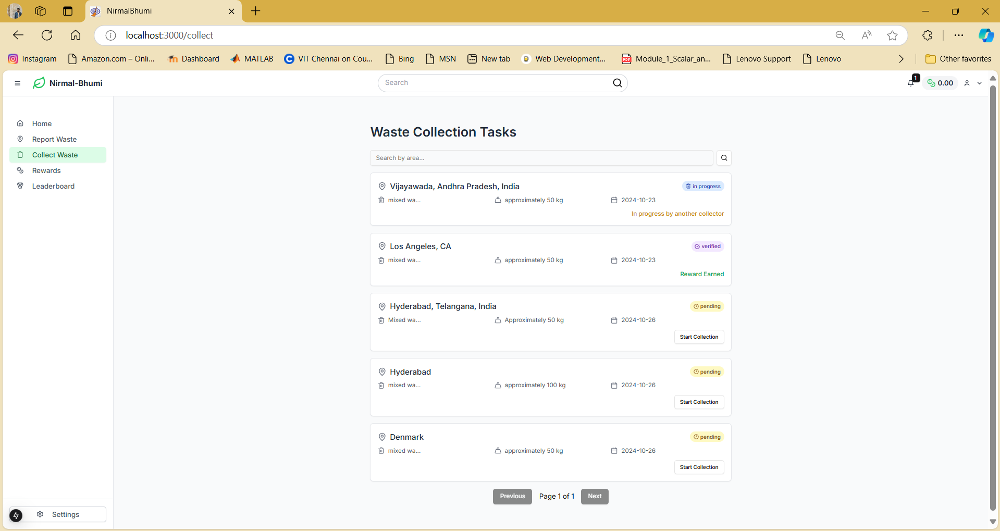
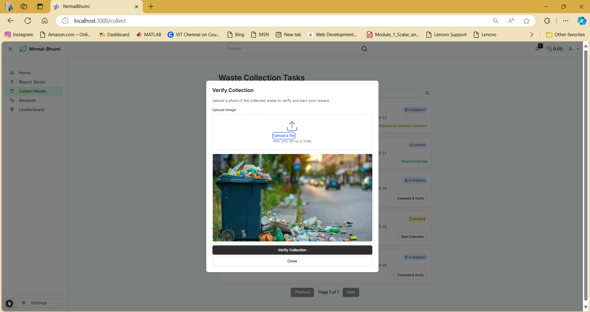
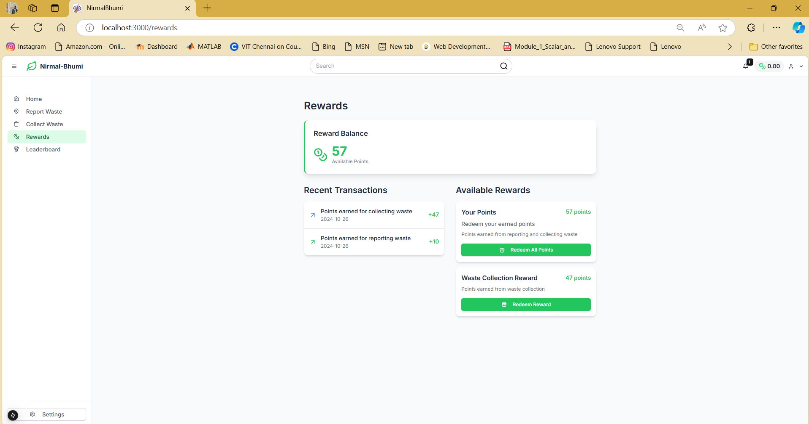
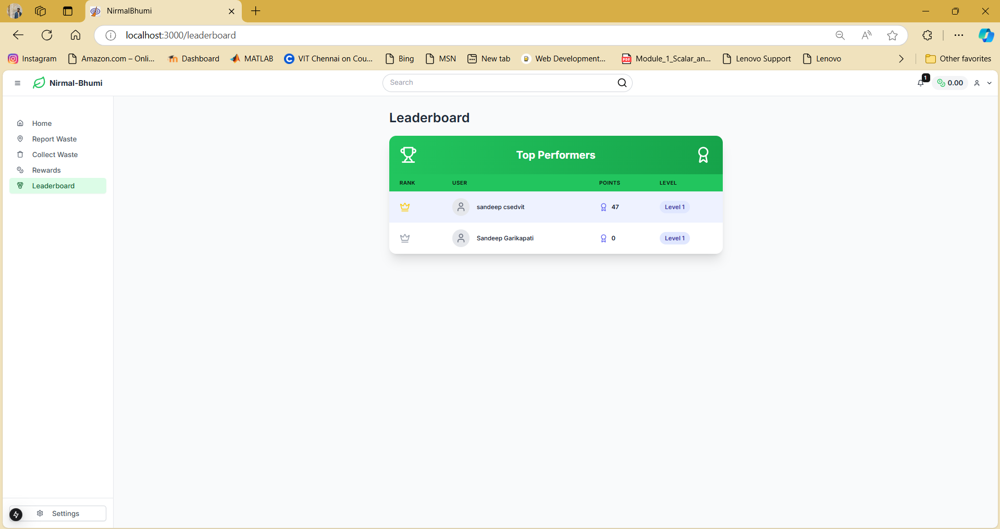

## 

This web application leverages Gemini AI to streamline waste management. Users upload waste images, which Gemini analyzes to identify the waste type (e.g., plastic, paper) and estimates the quantity. After submission, a verifier uploads a photo of the collected waste to verify the match. If confirmed, the system rewards the waste collector with points, promoting responsible waste disposal and recycling.

        

## Table of contents
- [Features](#features)
- [Getting Started](#getting-started)
  - [Prerequisites](#prerequisites)
  - [Installation](#installation)
  - [Running the Application](#running-the-application)
- [Usage](#usage)
- [Deployment](#deployment)
- [Technologies Used](#technologies-used)
- [Contributing](#contributing)
- [License](#license)

## Features
- **AI-Powered Waste Classification**: Automatically identifies waste type (e.g., plastic, paper, metal) and estimates quantity using Gemini AI.
- **User Submission Portal**: Allows users to upload waste images for analysis and submit them for verification.
- **Verifier Photo Matching**: Enables verifiers to upload a photo of the collected waste for matching with the original submission.
- **Reward Points System**: Awards points to waste collectors upon successful verification, incentivizing waste collection and recycling.
- **Admin Dashboard**: Provides an admin view to manage submissions, verifications, and track reward distributions.

## Getting Started

### Prerequisties
Before you begin please make sure to install this prerequisities
-Node.js (v18 or higher)
-npm or yarn
-neon Database account
-Drizzle orm
-Vs code or similar IDE'S

### Installation
1. Clone the repository
   ```
   git clone https://github.com/SandeepGarikapati/CleanIndia.git

   ```
2. Install the Dependencies
   ```
   npm install
   # or
   yarn install

   ```

### Running the Application
1. Setup the .env.local file with required api keys

```env
NEXT_PUBLIC_WEB3AUTH_CLIENT_ID = WEB3AUTH api for Authentication related services.
DATABASE_URL = Database url from postgress sql.
NEXT_PUBLIC_GEMINI_API_KEY = Gemini API Key
NEXT_PUBLIC_MAPS_API_KEY = Google Maps API Key.
```

2. First, run the development server:

```bash
npm run dev
# or
yarn dev
# or
pnpm dev
# or
bun dev
```

3. Open [http://localhost:3000](http://localhost:3000) with your browser to see the result.

## Usage

1. Login to the Website using WEB3Authentication
   


2. Home Page of the Website.



3. Waste Repport page.



4. Waste Collection Tasks Display page.



5. Waste verification page.



6. Rewards Page.



7. Leaderboard page




## Deployment

To deploy the application on Vercel:

1. Push your project to a GitHub repository.
2. Go to the Vercel dashboard and import your repository.
3. Set up your environment variables in the Vercel project settings.
4. Deploy the project. Vercel will automatically build and deploy your application.

## Technologies Used

- [Next.js](https://nextjs.org/)
- [Tailwind CSS](https://tailwindcss.com/)
- [Shad cn UI](https://ui.shadcn.com/)
- [TypeScript](https://www.typescriptlang.org/)
- [Speech to text convertor](https://www.npmjs.com/package/react-hook-stt-fork)
- [Drizzle orm](https://www.npmjs.com/package/drizzle-orm)
- [Vercel](https://vercel.com/)

## Contributing

Contributions are welcome! Please follow these steps:

1. Fork the repository.
2. Create a new branch (`git checkout -b feature/your-feature-name`).
3. Make your changes.
4. Commit your changes (`git commit -m 'Add some feature'`).
5. Push to the branch (`git push origin feature/your-feature-name`).
6. Open a pull request.

## License

This project is licensed under the MIT License. See the [LICENSE](LICENSE) file for details.

---

Thank you for using Nirmal-Bharath. Contribute to cleanliness, dispose of waste the right way!
